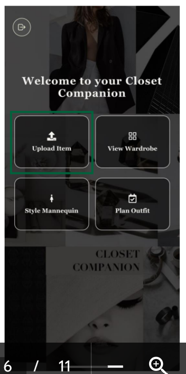
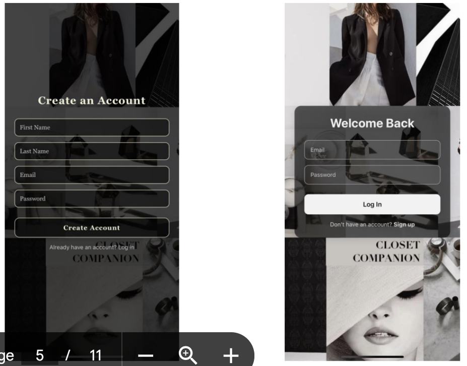
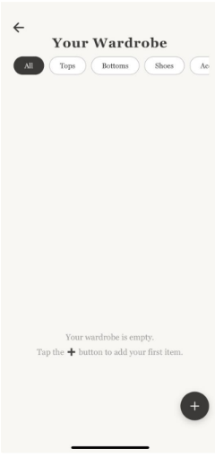
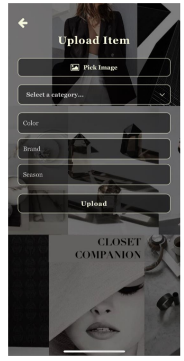
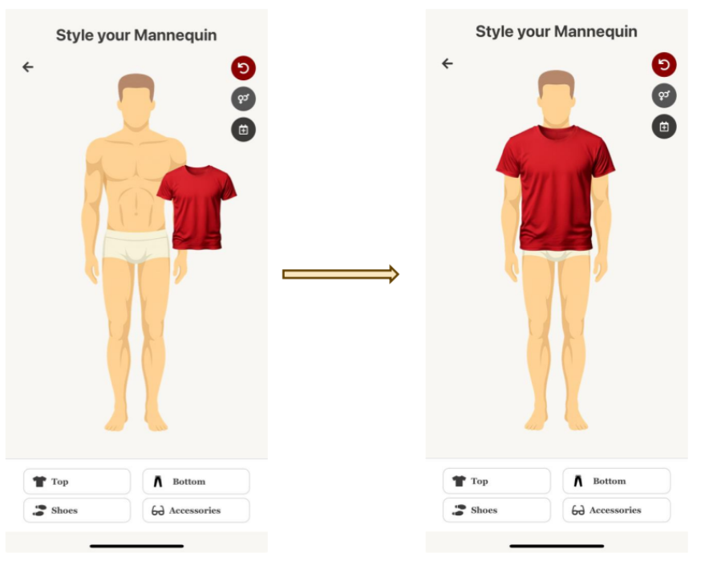
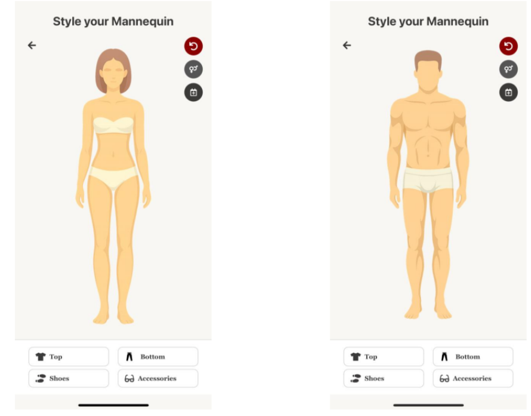
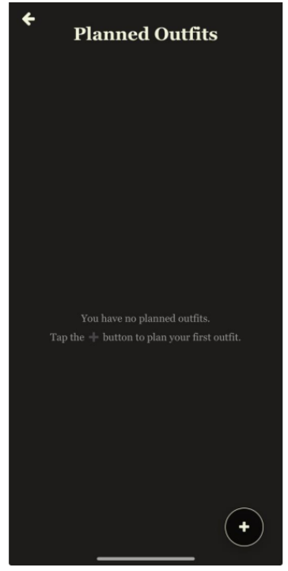

# Virtual Wardrobe App

A full-stack virtual wardrobe application that allows users to organize clothing items, manage outfits, and plan looks digitally.

---

## Preview

### Home Screen


### Login Screen


### Wardrobe View


### Upload Clothing Item


### Outfit Planning


### Mannequin View


### Planned Outfit


---

## Overview

Virtual Wardrobe App is designed to help users digitize their wardrobe and plan outfits efficiently. The application allows users to upload clothing items, browse their wardrobe, and create outfit combinations through an interactive interface.

The project includes frontend, backend, and database components, demonstrating full-stack application development.

---

## Features

- User authentication flow  
- Digital wardrobe management  
- Clothing item upload functionality  
- Outfit planning interface  
- Visual mannequin/outfit preview  
- Full-stack architecture (frontend, backend, database)  

---

## Tech Stack

- JavaScript  
- React Native / Expo  
- Python  
- Backend APIs  
- Database integration  

---

## Project Structure

```text
Virtual-Wardrobe-App/
├── frontend/
├── backend/
├── database/
├── Images/
│   ├── HomeScreen.png
│   ├── LogInScreen.png
│   ├── Wardrobe.png
│   ├── UploadItemScreen.png
│   ├── DressingUp.png
│   ├── MannequinScreen.png
│   └── PlannedOutfit.png
├── package.json
├── package-lock.json
└── README.md
```

---

## My Contributions

- Developed and refined frontend features and UI interactions  
- Integrated frontend components with backend logic  
- Worked on wardrobe and outfit management functionality  
- Debugged and improved application performance and flow  

---

## Status

This project is a functional full-stack prototype demonstrating application architecture, UI development, and backend integration. Future improvements could include deployment, enhanced authentication, and advanced outfit recommendation features.

---

## Author

Jad Jonaidi
